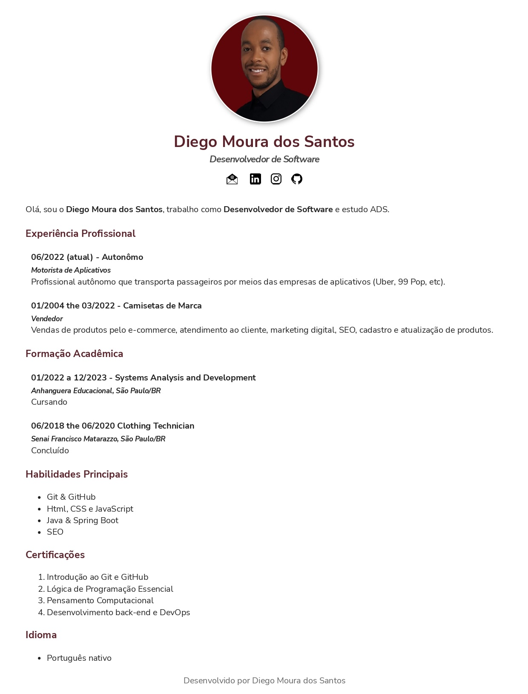

<h1>📚 Projeto Currículo</h1>

Este projeto consiste na criação de um currículo personalizado, utilizando as tecnologias HTML e CSS com a estrutura do HTML 5. A proposta é permitir que o usuário desenvolva seu próprio currículo de maneira personalizada, adequando-o às suas necessidades e aprofundando seus conhecimentos em HTML e CSS.

    

 

## :page_facing_up: HTML5

    O projeto usa as principais tags HTML, como html, head, body, h1 a h6, p, img, a, ul, ol, entre outras. Essas tags são usadas para definir a estrutura e o conteúdo da página.
    
    Os principais conceitos do HTML que são usados no projeto incluem a estrutura do documento HTML, o uso de tags para definir o conteúdo e a formatação da página, e a importância da semântica do HTML para facilitar a acessibilidade e a indexação pelos mecanismos de busca.
    
    A indentação é um aspecto importante do código HTML, pois ajuda a manter o código organizado e legível. Os títulos e parágrafos são usados para estruturar o conteúdo da página, enquanto a formatação de texto é usada para enfatizar certos elementos e melhorar a legibilidade.
    
    O projeto também inclui o uso de imagens, links e listas para criar uma página mais dinâmica e informativa. O arquivo index.html é utilizado como página inicial do currículo.

     

## :black_nib: CSS3

O CSS é usado para estilizar a página, e o projeto utiliza os diferentes tipos de estilos do CSS, incluindo estilos externos, internos e inline. A estilização é aplicada a tags, classes e IDs, e inclui propriedades como cor, background, border, margin, padding, box model e box shadow. A tag div é usada para criar seções distintas da página, que podem ser estilizadas separadamente.

 

## 🤝 Faça sua Contribuição 

Esse repositório foi criado com o objetivo de estudar e aprimorar os conhecimentos em HTML5 e CSS3. Gostaría de convidá-los (as) a contribuir para o projeto, afinal, juntos podemos criar algo ainda melhor!

Caso tenha encontrado algo que tenha sido útil para você, ficarei muito feliz em saber que o meu trabalho está sendo útil para outras pessoas. Compartilhe também com seus amigos e conhecidos que possam se interessar pelo conteúdo.

Agradeço por sua visita e espero que possamos continuar a evoluir juntos!

 

> ## Se possível

- 🐛 Encontre e relate issues para que possamos corrigir eventuais bugs e melhorar a experiência do usuário. 
- ⭐️ Se gostou do trabalho, por favor, considere dar uma estrela ao projeto.  
- 🤝 Sua contribuição é muito importante para mim ajudar a continuar evoluindo. Obrigado pela visita!"

 
Desenvolvido 😜 por [Diego Moura dos Santos](https://www.linkedin.com/in/diegomouradossantos/).
